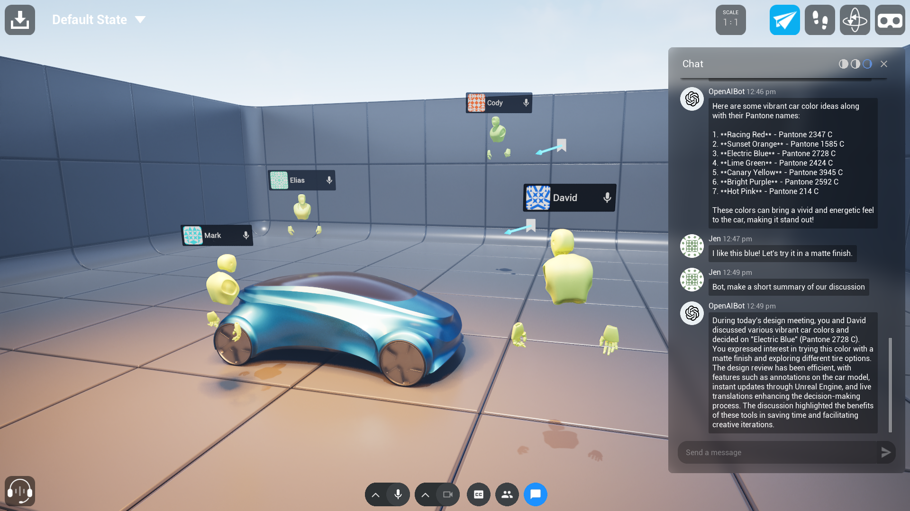
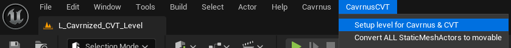
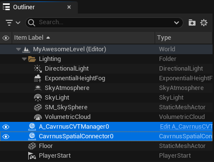
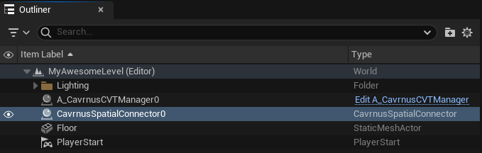
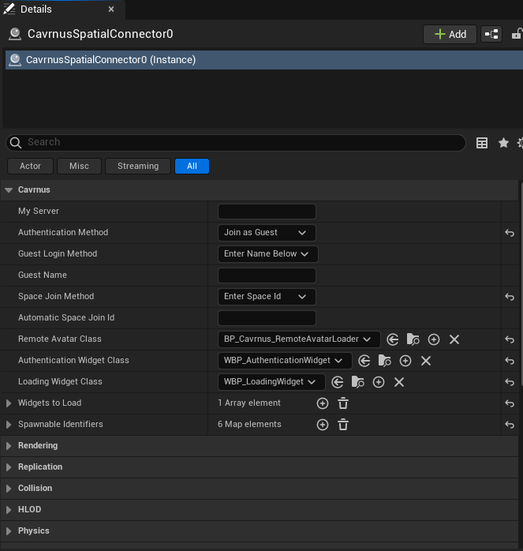



    

# 
Cavrnus Collaborative Viewer Template (CVT)

<h4 align="center">
  
    
  
    
</h4>

<h4 align="center">
    </a>
    </h4>

    
## Project Information  
**Version:** 1.0.0    
**Last Updated:** 2024-09-13    
**Documentation:** [Cavrnus CVT Documentation](https://cavrnus.atlassian.net/wiki/spaces/CSM/pages/948764675/Cavrnus+CVT+Integration+Guide)     

## Introduction

### Overview
The CavrnusCVT plugin offers a seamless way to integrate multi-user collaboration, real-time communication, and Datasmith synchronization into CVT Unreal Engine template projects or even mature, established projects. By simply dragging the Cavrnus plugin into the CVT project, users can effortlessly enhance 3D workflows and embed collaborative features directly into their Unreal projects.

### Project Contents
This repo includes both the CavrnusCVT plugin and the corresponding CavrnusConnector plugin. These must live together in your project's plugin folder in order for proper functionality.

### Requirements
- Unreal Engine 5.x.x

## Getting Started

### Opening Git Project
1. Clone the project using your preferred Git client.
2. Open the project in Unreal Engine 5.x.x.
3. When prompted, opt to build the required modules.
4. Follow the prompts during the build process (note: it is not necessary to generate a project solution).
Once the build completes, the project should open automatically.

## Installing in Other Projects
Need CVT features in other projects? It's easy to use the power of Cavrnus and CVT by simply dragging the plugins into other projects.

1. Locate plugins in this project
    * a. Find the /Plugins folder located in root project folder.
    * b. Select/Copy both the CavrnusConnector and CavrnusCVT folders.
        

2. Navigate to the target project you would like to add these plugins to.
3. In the target project's root folder, locate the Plugins folder (create one if it doesn't exist).
    * a. Paste both the CavrnusConnector and CavrnusCVT folders into this folder.

4. Open the project
    * a. Either use the .uproject file as normally and opt to rebuild the new modules.
    * b. Or regenerate the solution files if it is a C++ project.

### Setup

1. Once your project is open, navigate to <b>Edit > Plugins</b>. This opens the <b>Plugins</b> window.

2. Verify the <b>CavrnusConnector</b> and <b>CavrnusCVT</b> plugins are present and enabled.
        

 

### Quick Start Guide
Starting from an existing level is easy!

1. Navigate to and select <b>CavrnusCVT > Setup level for Cavrnus & CVT</b>.
    

 

2. Your level now has the necessary Cavrnus actors.
    

 

3. In the level Outliner, select the CavrnusSpatialConnector instance.
    

 

2. From the Details panel, you can now configure all of your connection settings for this project. For in-depth help with setting up the Cavrnus Spatial Connector actor, see [Configure the Cavrnus Spatial Connector](https://cavrnus.atlassian.net/wiki/spaces/CSM/pages/872742940/Configure+the+Cavrnus+Spatial+Connector+Unreal+Engine) documentation.
    

 

### **Full Cavrnus CVT Integration Guide** 
The CavrnusCVT project also includes an in-depth guide of the [Cavrnus + CVT integration process](https://cavrnus.atlassian.net/wiki/spaces/CSM/pages/948764675/Cavrnus+CVT+Integration+Guide).

For more information on the underlying CavrnusConnector plugin of which the CavnrusCVT plugin is built upon, refer to [Cavrnus + CVT integration process](https://cavrnus.atlassian.net/wiki/spaces/CSM/pages/872808449/Cavrnus+Spatial+Connector+for+Unreal+Engine).

## Support and Feedback
Do you need help? Have you found a bug? Reach out through the [Cavrnus Discord](https://discord.gg/AzgenDT7Ez).